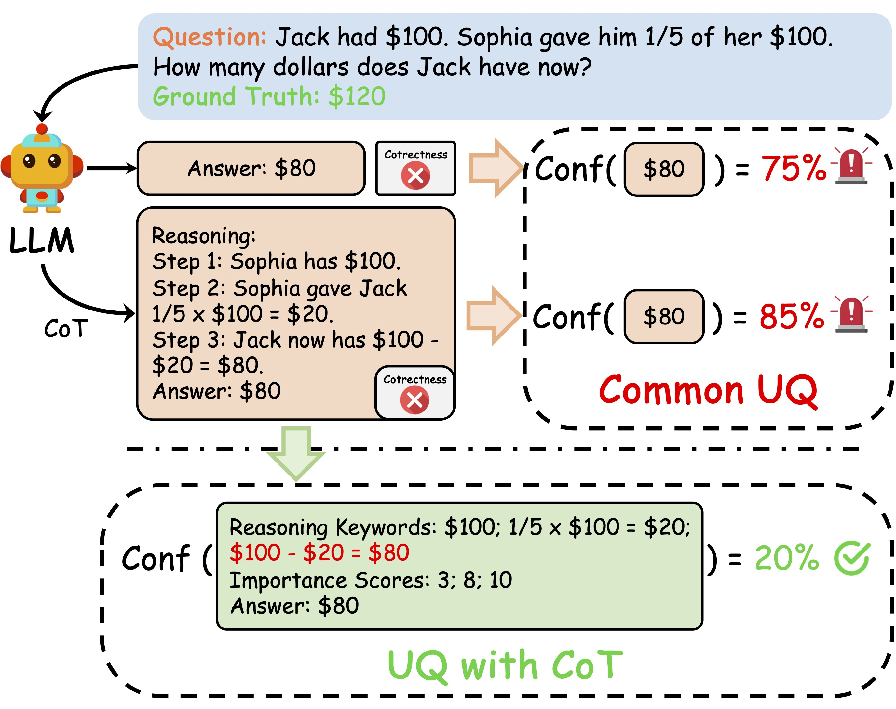
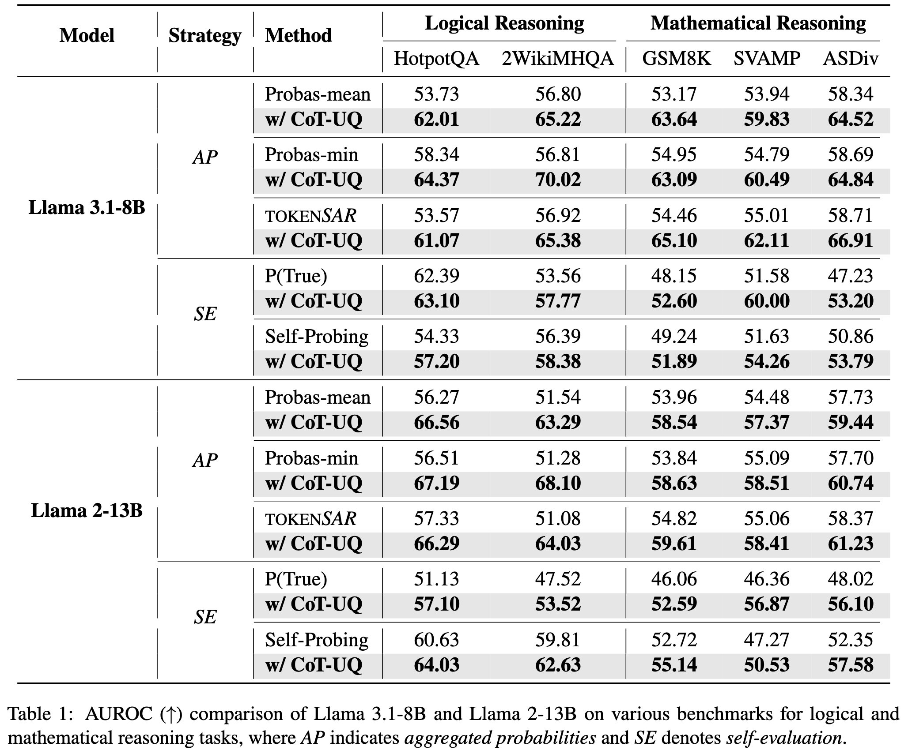

<h1 align='center'>
CoT-UQ: Improving Response-wise Uncertainty Quantification in LLMs with Chain-of-Thought
</h1>

<p align='center'>
<a href="https://arxiv.org/abs/2502.17214"></a> 

<a href="https://opensource.org/licenses/MIT"></a>


</p>

This is the codebase of the paper: CoT-UQ: Improving Response-wise Uncertainty Quantification in LLMs with Chain-of-Thought ([arXiv](https://arxiv.org/abs/2502.17214)).

**Author List**: Boxuan Zhang, Ruqi Zhang

<div align="center">
    
    <br>
    <em>Comparison of <strong>existing UQ strategies</strong> with <strong>CoT-UQ</strong></em>
</div>

<br>

[2024/02/21]🔥 We are releasing the **CoT-UQ** version 1.0 for running on Llama Family models.

## Getting Start

### 1. Install Dependencies

Update your environment for the required dependency. 

```shell
pip install -r requirement.txt
```

### 2. Data Preparation

* Datasets adopted in the paper are listed in `CoT-UQ/dataset/`

* You can also upload your json version of dataset on `CoT-UQ/dataset/`

* Setting for loading your dataset on `CoT-UQ/utils.py`.

#### Example

```shell
if args.dataset.lower() == 'gsm8k':
      for idx, line in enumerate(json_data):
            q = line['question']
            a = float(line['answer'])
            id = 'temp_{}'.format(idx)
      questions.append(q)
      answers.append(a)
      ids.append(id)
```

### 3. Running CoT-UQ Pipeline

Get your Llama Family weight in https://huggingface.co/meta-llama

`run_llama_pipeline.sh` is a script that executes all steps of our pipeline on the `Llama` Family.

The components of our pipeline are:
* `inference_refining.py` focuses on refining the multi-step inference by extracting keywords and their corresponding importance scores to the final answer.
* `stepuq.py` integrates the crucial reasoning information into the two common UQ strategies, aggregated probabilities and self-evaluation, respectively.

For instance, running the code on `Llama3.1-8B`:

```shell
sh run_llama_pipeline.sh llama3-1_8B probas_mean hotpotQA output/llama-3.1-8B/
```

### 4. Analyzing Results

After running the pipeline, use `analyze_result.py` to compute performance metrics, such as the AUROC.

```shell
python analyze_result.py --uq_engine probas_mean --dataset hotpotQA --output_path output/llama-3.1-8B/
```

## Main Results



* CoT-UQ consistently improves UQ performance across all tasks and datasets. 
* This demonstrates that incorporating reasoning into uncertainty quantification enables LLMs to provide more calibrated assessments of the trustworthiness of their generated outputs. 
* In general, CoT-UQ achieves greater improvements when applied to *AP* strategies compared to *SE* strategies, particularly for **Probas-min**, where it increases AUROC by up to **16.8%**.

## Citation

If you find our paper and repo useful, please cite our paper:

```bibtex 
@inproceedings{zhang2025cot-uq,
  title={CoT-UQ: Improving Response-wise Uncertainty Quantification in LLMs with Chain-of-Thought},
  author={Zhang, Boxuan and Zhang, Ruqi},
  booktitle={ArXiv},
  year={2025},
} 
```
